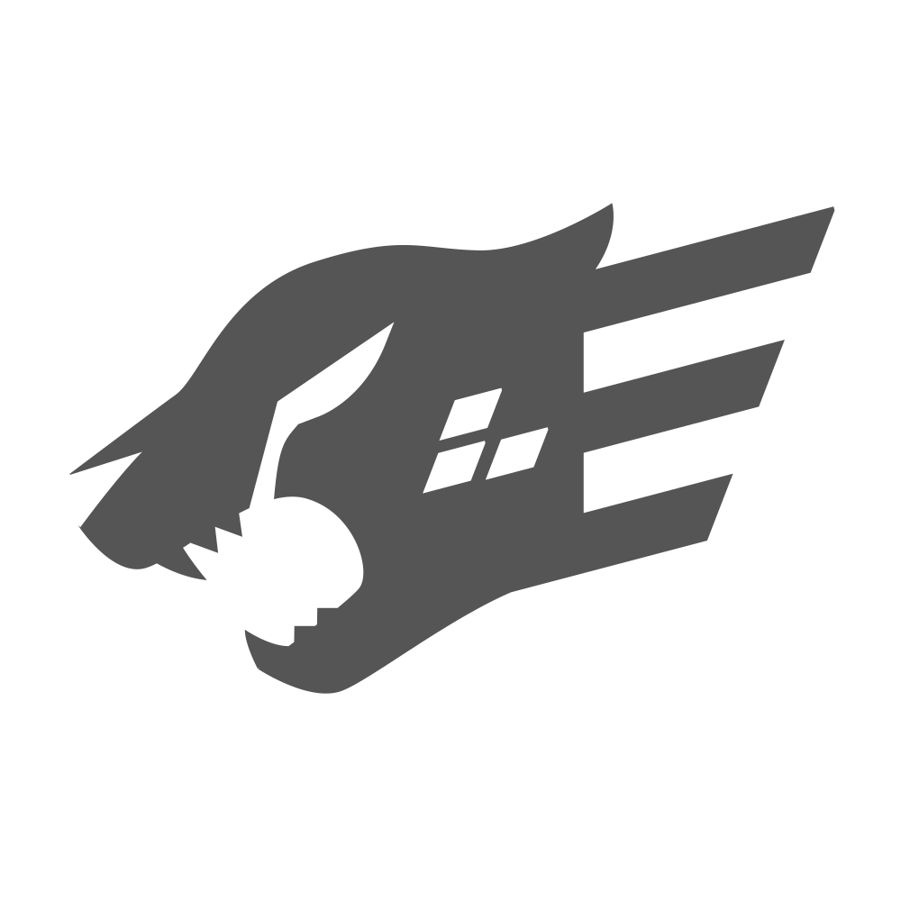
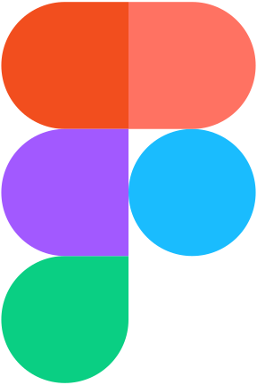

<h1 align="center">Hey there, I'm Palm!</h1>

I am a 15-year-old full-stack developer who is interested in UI/UX, security, and automation <i>(CI/CD)</i>.

 

## 🖥️ Technologies
These are technologies I'm currently using or have used in the past.

 

## 👨🏻‍💻 Projects

These are my projects or contributions towards open-source projects sorted by how many contributions I’ve made to them and how popular, useful, or important they are.

 
 

### [ReVanced](https://github.com/revanced)
ReVanced is a modular patcher for apps such as YouTube. This project was born out of Vanced's discontinuation. I’ve contributed to this project many times.

 
 
 

### Other projects coming soon!
I have some ideas...

 
 

## 📄 Contact
You can always [email me](mailto:palmpasuthorn@gmail.com) or talk with me on [Discord](https://discord.com/users/629368283354628116). I usually don't accept friend requests on Discord, so you will need to join servers that I'm in and DM me from there.

### 💬 Servers I'm Active In
- [The Programmer's Hangout](https://discord.gg/programming)
- [ReVanced](https://discord.gg/revanced)
